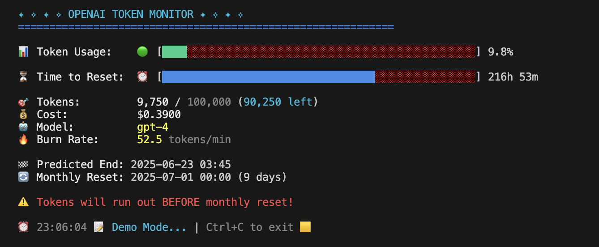

# 🎯 OpenAI API Usage Monitor

[](https://python.org)
[](https://opensource.org/licenses/MIT)
[](http://makeapullrequest.com)

A beautiful real-time terminal monitoring tool for OpenAI API token usage. Track your token consumption, burn rate, costs, and get predictions about when you'll run out of tokens.



---

## 📑 Table of Contents

- [✨ Key Features](#-key-features)
- [🚀 Installation](#-installation)
  - [⚡ Quick Start](#-quick-start)
  - [🔒 Production Setup (Recommended)](#-production-setup-recommended)
  - [Virtual Environment Setup](#virtual-environment-setup)
- [📖 Usage](#-usage)
  - [Basic Usage](#basic-usage)
  - [Configuration Options](#configuration-options)
  - [Available Plans](#available-plans)
- [✨ Features & How It Works](#-features--how-it-works)
  - [Current Features](#current-features)
  - [Understanding OpenAI Usage](#understanding-openai-usage)
  - [Token Limits by Plan](#token-limits-by-plan)
  - [Smart Detection Features](#smart-detection-features)
- [🚀 Usage Examples](#-usage-examples)
  - [Common Scenarios](#common-scenarios)
  - [Best Practices](#best-practices)
- [Troubleshooting](#troubleshooting)
  - [No active session found](#no-active-session-found)
- [📞 Contact](#-contact)
- [📚 Additional Documentation](#-additional-documentation)

---

## ✨ Key Features

- **🔄 Real-time monitoring** - Updates every 3 seconds with smooth refresh
- **📊 Visual progress bars** - Beautiful color-coded token and time progress bars
- **🔮 Smart predictions** - Calculates when tokens will run out based on current burn rate
- **💰 Cost tracking** - Monitor your API spending in real-time
- **📋 Multiple tier support** - Works with all OpenAI usage tiers (Tier 1-5)
- **⚠️ Warning system** - Alerts when tokens exceed limits or will deplete before monthly reset
- **💼 Professional UI** - Clean, colorful terminal interface with emojis
- **🗄️ Local database** - SQLite storage for session and usage tracking
- **🎭 Demo mode** - Test the monitor with simulated data

---

## 🚀 Installation

### ⚡ Quick Start

For immediate testing with demo mode:

```bash
# Clone and setup
git clone https://github.com/reachbrt/OpenAI-Code-Usage-Monitor.git
cd OpenAI-Code-Usage-Monitor
python3 -m venv venv
source venv/bin/activate
pip install -r requirements.txt

# Run demo mode
python openai_usage_monitor.py --demo
```

### 🔒 Production Setup (Recommended)

#### Prerequisites

1. **Python 3.6+** installed on your system
2. **OpenAI API key** from your OpenAI account

### Virtual Environment Setup

#### Why Use Virtual Environment?

Using a virtual environment is **strongly recommended** because:

- **🛡️ Isolation**: Keeps your system Python clean and prevents dependency conflicts
- **📦 Portability**: Easy to replicate the exact environment on different machines
- **🔄 Version Control**: Lock specific versions of dependencies for stability
- **🧹 Clean Uninstall**: Simply delete the virtual environment folder to remove everything
- **👥 Team Collaboration**: Everyone uses the same Python and package versions

#### Installing virtualenv (if needed)

If you don't have `venv` module available:

```bash
# Ubuntu/Debian
sudo apt-get update
sudo apt-get install python3-venv

# Fedora/RHEL/CentOS
sudo dnf install python3-venv

# macOS (usually comes with Python)
# If not available, install Python via Homebrew:
brew install python3

# Windows (usually comes with Python)
# If not available, reinstall Python from python.org
# Make sure to check "Add Python to PATH" during installation
```

Alternatively, use the `virtualenv` package:
```bash
# Install virtualenv via pip
pip install virtualenv

# Then create virtual environment with:
virtualenv venv
# instead of: python3 -m venv venv
```

#### Step-by-Step Setup

```bash
# 1. Clone the repository
git clone https://github.com/reachbrt/OpenAI-Code-Usage-Monitor.git
cd OpenAI-Code-Usage-Monitor

# 2. Create virtual environment
python3 -m venv venv
# Or if using virtualenv package:
# virtualenv venv

# 3. Activate virtual environment
# On Linux/Mac:
source venv/bin/activate
# On Windows:
# venv\Scripts\activate

# 4. Install Python dependencies
pip install -r requirements.txt

# 5. Set your OpenAI API key
export OPENAI_API_KEY="your-api-key-here"

# Alternative: Use the setup template
cp setup_env_template.sh setup_env.sh
# Edit setup_env.sh with your actual API key, then:
# source setup_env.sh

# 6. Make script executable (Linux/Mac only)
chmod +x openai_usage_monitor.py

# 7. Run the monitor
python openai_usage_monitor.py
```

#### Daily Usage

After initial setup, you only need:

```bash
# Navigate to project directory
cd OpenAI-Code-Usage-Monitor

# Activate virtual environment
source venv/bin/activate  # Linux/Mac
# venv\Scripts\activate   # Windows

# Set API key (if not already set)
export OPENAI_API_KEY="your-api-key-here"

# Run monitor
./openai_usage_monitor.py  # Linux/Mac
# python openai_usage_monitor.py  # Windows

# Or use the quick start script
./start_openai_monitor.sh tier2

# When done, deactivate
deactivate
```

#### Pro Tip: Shell Alias

Create an alias for quick access:
```bash
# Add to ~/.bashrc or ~/.zshrc
alias openai-monitor='cd ~/OpenAI-Code-Usage-Monitor && source venv/bin/activate && ./openai_usage_monitor.py'

# Then just run:
openai-monitor
```

---

## 📖 Usage

### Basic Usage

```bash
# Set your OpenAI API key
export OPENAI_API_KEY="your-api-key-here"

# Default (Tier 1 - 100,000 tokens/month)
./openai_usage_monitor.py

# Demo mode (no API key required)
./openai_usage_monitor.py --demo

# Exit the monitor
# Press Ctrl+C to gracefully exit
```

### Configuration Options

#### Specify Your Usage Tier

```bash
# Tier 1 (~100k tokens/month) - Default
./openai_usage_monitor.py --plan tier1

# Tier 2 (~500k tokens/month)
./openai_usage_monitor.py --plan tier2

# Tier 3 (~1M tokens/month)
./openai_usage_monitor.py --plan tier3

# Tier 4 (~5M tokens/month)
./openai_usage_monitor.py --plan tier4

# Tier 5 (~50M tokens/month)
./openai_usage_monitor.py --plan tier5

# Custom limit
./openai_usage_monitor.py --plan custom --limit 250000
```

#### Timezone Configuration

The default timezone is **UTC**. Change it to any valid timezone:

```bash
# Use US Eastern Time
./openai_usage_monitor.py --timezone US/Eastern

# Use Tokyo time
./openai_usage_monitor.py --timezone Asia/Tokyo

# Use London time
./openai_usage_monitor.py --timezone Europe/London

# Use UTC (default)
./openai_usage_monitor.py --timezone UTC
```

#### Quick Start Script

```bash
# Use the convenient start script
./start_openai_monitor.sh demo     # Demo mode
./start_openai_monitor.sh tier2    # Tier 2 limits
./start_openai_monitor.sh tier3    # Tier 3 limits
```

### Available Plans

| Plan | Token Limit | Approximate Monthly Cost |
|------|-------------|-------------------------|
| **tier1** | ~100,000 | $100 |
| **tier2** | ~500,000 | $500 |
| **tier3** | ~1,000,000 | $1,000 |
| **tier4** | ~5,000,000 | $5,000 |
| **tier5** | ~50,000,000 | $50,000 |
| **custom** | User-defined | Variable |

---

## ✨ Features & How It Works

### Current Features

#### 🔄 Real-time Monitoring
- Updates every 3 seconds with smooth refresh
- No screen flicker - intelligent display updates
- Live token consumption and cost tracking

#### 📊 Visual Progress Bars
- **Token Progress**: Color-coded bars showing current usage vs limits
- **Time Progress**: Visual countdown to next monthly reset
- **Burn Rate Indicator**: Real-time consumption velocity

#### 🔮 Smart Predictions
- Calculates when tokens will run out based on current burn rate
- Warns if tokens will deplete before next monthly reset
- Analyzes usage patterns from recent API calls

#### 💰 Cost Tracking
- **Real-time Cost Monitoring**: Track API spending as it happens
- **Model-specific Pricing**: Different costs for different models
- **Monthly Budget Tracking**: Monitor against your usage tier limits

### 🚀 Enhanced Features (NEW!)

#### 📊 Advanced Analytics
- **Usage History**: Track daily, weekly, and monthly usage patterns
- **Model Breakdown**: Detailed analysis by GPT-4, GPT-3.5-turbo, etc.
- **Hourly Patterns**: Understand when you use the API most
- **Burn Rate Analysis**: Track token consumption trends over time

#### 📈 Smart Reporting & Export
- **CSV Export**: Export usage data for spreadsheet analysis
- **JSON Export**: Machine-readable data for integration with other tools
- **Historical Reports**: Generate reports for any time period (7, 30, 90 days)
- **Cost Analysis**: Detailed cost breakdowns by model and time period

#### 💰 Budget Management
- **Monthly Budgets**: Set spending limits with automatic alerts
- **Smart Thresholds**: Get notified at 50%, 75%, and 90% usage
- **Cost Predictions**: Forecast monthly spending based on current usage
- **Budget Tracking**: Monitor spending against your set limits

#### 🔔 Intelligent Alerts
- **Usage Warnings**: Early alerts before hitting token limits
- **Unusual Patterns**: Detect spikes in usage or unexpected costs
- **Budget Notifications**: Stay within your monthly budget
- **Real-time Alerts**: Get notified during monitoring sessions

#### 🎯 Quick Commands
```bash
# View analytics for last 7 days
./start_openai_monitor.sh analytics

# View analytics for last 30 days
./start_openai_monitor.sh analytics-30

# Export usage data to CSV
./start_openai_monitor.sh export-csv

# Export usage data to JSON
./start_openai_monitor.sh export-json

# Set monthly budget to $50
./start_openai_monitor.sh budget-50

# Set monthly budget to $100
./start_openai_monitor.sh budget-100
```

### Understanding OpenAI Usage

#### How OpenAI API Billing Works

OpenAI operates on a **monthly billing cycle**:

1. **Monthly Limits**: Usage limits reset on the first day of each month
2. **Token Tracking**: Both prompt and completion tokens are counted
3. **Model Costs**: Different models have different per-token costs
4. **Real-time Usage**: API calls are tracked immediately

#### Session Management

The monitor creates **usage sessions** to track your API consumption:

1. **Session Start**: Begins when you start the monitor
2. **API Call Logging**: Each API call is logged with tokens and cost
3. **Burn Rate Calculation**: Based on API calls in the last hour
4. **Session Persistence**: Data stored in local SQLite database

#### Burn Rate Calculation

The monitor calculates burn rate using sophisticated analysis:

1. **Data Collection**: Gathers token usage from API calls in the last hour
2. **Pattern Analysis**: Identifies consumption trends across recent calls
3. **Velocity Tracking**: Calculates tokens consumed per minute
4. **Prediction Engine**: Estimates when monthly tokens will deplete
5. **Real-time Updates**: Adjusts predictions as usage patterns change

### Token Limits by Tier

#### OpenAI Usage Tiers

| Tier | Monthly Limit | Approximate Cost | Typical Usage |
|------|---------------|------------------|---------------|
| **Tier 1** | ~100,000 tokens | $100 | Light usage, testing, learning |
| **Tier 2** | ~500,000 tokens | $500 | Regular development work |
| **Tier 3** | ~1,000,000 tokens | $1,000 | Heavy usage, production apps |
| **Tier 4** | ~5,000,000 tokens | $5,000 | Large-scale applications |
| **Tier 5** | ~50,000,000 tokens | $50,000 | Enterprise usage |

#### Custom Limits

| Plan | How It Works | Best For |
|------|-------------|----------|
| **custom** | User-defined token limit | Users with specific budget constraints |

---

## 🚀 Usage Examples

### Common Scenarios

#### 🌅 Development Team
**Scenario**: You're working on a project and want to monitor API usage across your team.

```bash
# Set up monitoring for your timezone
export OPENAI_API_KEY="your-key"
./openai_usage_monitor.py --plan tier3 --timezone US/Eastern
```

**Benefits**:
- Track monthly usage against your tier limits
- Monitor costs in real-time
- Get early warnings before hitting limits

#### 🌙 Individual Developer
**Scenario**: You're building a personal project and want to stay within budget.

```bash
# Monitor with custom budget limit
./openai_usage_monitor.py --plan custom --limit 150000 --timezone Europe/London
```

**Strategy**:
- Set custom limits based on your budget
- Monitor burn rate during development
- Plan feature development around monthly resets

#### 🔄 Production Application
**Scenario**: You have a production app and need to monitor API costs.

```bash
# High-tier monitoring for production
./openai_usage_monitor.py --plan tier4 --timezone UTC
```

**Approach**:
- Use higher tier limits for production workloads
- Monitor costs and usage patterns
- Set up alerts for unusual usage spikes

#### 🌍 International Team
**Scenario**: You're working across different timezones.

```bash
# US East Coast
./openai_usage_monitor.py --timezone America/New_York --plan tier2

# Europe
./openai_usage_monitor.py --timezone Europe/London --plan tier2

# Asia Pacific
./openai_usage_monitor.py --timezone Asia/Singapore --plan tier2

# UTC for international coordination
./openai_usage_monitor.py --timezone UTC --plan tier3
```

#### ⚡ Quick Check
**Scenario**: You just want to see current status without configuration.

```bash
# Demo mode (no API key required)
./openai_usage_monitor.py --demo

# Quick check with defaults
export OPENAI_API_KEY="your-key"
./openai_usage_monitor.py

# Press Ctrl+C after checking status
```

### Tier Selection Strategies

#### How to Choose Your Tier

**Start with Demo Mode (Recommended for New Users)**
```bash
# Test the interface without API calls
./openai_usage_monitor.py --demo
```
- See how the monitor works
- Understand the interface
- No API key required

**Known Usage Tier**
```bash
# If you know your OpenAI tier
./openai_usage_monitor.py --plan tier2  # or tier1, tier3, tier4, tier5
```

**Custom Budget**
```bash
# Set custom monthly token limit
./openai_usage_monitor.py --plan custom --limit 250000
```

### Best Practices

#### Setup Best Practices

1. **Start Monitoring Early**
   ```bash
   # Begin monitoring when starting API development
   export OPENAI_API_KEY="your-key"
   ./openai_usage_monitor.py --plan tier2
   ```
   - Track usage from the beginning of your project
   - Better burn rate calculations
   - Early warning for limit approaches

2. **Use Virtual Environment**
   ```bash
   # Production setup with isolation
   python3 -m venv venv
   source venv/bin/activate
   pip install -r requirements.txt
   ```
   - Prevents dependency conflicts
   - Clean uninstallation
   - Reproducible environments

3. **Custom Shell Alias**
   ```bash
   # Add to ~/.bashrc or ~/.zshrc
   alias openai-monitor='cd ~/OpenAI-Code-Usage-Monitor && source venv/bin/activate && ./openai_usage_monitor.py'
   ```

4. **Integration with Your Code**
   ```bash
   # Use the tracker class in your applications
   from openai_usage_monitor import OpenAIUsageTracker
   tracker = OpenAIUsageTracker("your-api-key")
   ```

#### Usage Best Practices

1. **Monitor Burn Rate Velocity**
   - Watch for sudden spikes in token consumption
   - Adjust API call frequency based on remaining budget
   - Plan heavy usage around monthly resets

2. **Strategic Budget Planning**
   ```bash
   # Monitor with appropriate tier for your usage
   ./openai_usage_monitor.py --plan tier3 --timezone US/Eastern
   ```
   - Schedule large tasks after monthly resets
   - Use lighter models when approaching limits
   - Monitor costs across different models

3. **Timezone Awareness**
   ```bash
   # Always use your actual timezone
   ./openai_usage_monitor.py --timezone Europe/London
   ```
   - Accurate reset time predictions
   - Better planning for work schedules
   - Correct monthly reset estimates

#### Optimization Tips

1. **Terminal Setup**
   - Use terminals with at least 80 character width
   - Enable color support for better visual feedback
   - Consider dedicated terminal window for monitoring

2. **Workflow Integration**
   ```bash
   # Start monitoring with your development session
   tmux new-session -d -s openai-monitor './openai_usage_monitor.py --plan tier2'

   # Check status anytime
   tmux attach -t openai-monitor
   ```

3. **Cost Management Strategy**
   - Monitor different model costs (GPT-4 vs GPT-3.5-turbo)
   - Track monthly spending against your budget
   - Use demo mode for testing interface changes

#### Real-World Workflows

**Production Application**
```bash
# Setup for production monitoring
./openai_usage_monitor.py --plan tier4 --timezone UTC
```

**Development Workflow**:
1. **Start of Month**: Fresh token budget, plan major features
2. **Weekly Check**: Monitor burn rate, adjust model usage
3. **Mid-Month**: Assess remaining budget, optimize API calls
4. **End of Month**: Light usage, prepare for reset

**Learning & Experimentation**
```bash
# Budget-conscious setup for learning
./openai_usage_monitor.py --plan tier1 --timezone US/Pacific
```

**Team Development**
```bash
# High-usage team setup
./openai_usage_monitor.py --plan tier5 --timezone America/New_York
```

## Troubleshooting

### No active session found
If you encounter the error `No active session found`, please follow these steps:

1. **API Key Check**:
   Ensure your OpenAI API key is set correctly:
   ```bash
   export OPENAI_API_KEY="your-api-key-here"
   ./openai_usage_monitor.py
   ```

2. **Demo Mode**:
   Test the monitor interface without an API key:
   ```bash
   ./openai_usage_monitor.py --demo
   ```

3. **Database Issues**:
   If you encounter database errors, try removing the database file:
   ```bash
   rm openai_usage.db
   ./openai_usage_monitor.py
   ```

### API Connection Issues
If you can't connect to the OpenAI API:

1. Check your internet connection
2. Verify your API key is valid
3. Check OpenAI service status
4. Try demo mode to test the interface

---

## 📞 Contact

Have questions, suggestions, or want to collaborate? Feel free to reach out!

**📧 Email**: [reachbrt@gmail.com](mailto:reachbrt@gmail.com)
**🐙 GitHub**: [github.com/reachbrt](https://github.com/reachbrt)

Whether you need help with setup, have feature requests, found a bug, or want to discuss potential improvements, don't hesitate to get in touch. I'm always happy to help and hear from users of the OpenAI API Usage Monitor!

---

## 📚 Additional Documentation

- **[OpenAI README](README_OPENAI.md)** - Detailed OpenAI-specific documentation
- **[Integration Example](example_integration.py)** - How to integrate with your code
- **[Contributing Guide](CONTRIBUTING.md)** - How to contribute, development guidelines

---

## 📝 License

[MIT License](LICENSE) - feel free to use and modify as needed.

---

## 🙏 Acknowledgments

This tool provides comprehensive OpenAI API usage monitoring with real-time cost tracking, beautiful visualizations, and intelligent predictions.

Built with modern Python architecture and designed for developers who need precise control over their OpenAI API spending and usage patterns.

---

<div align="center">

**⭐ Star this repo if you find it useful! ⭐**

[Report Bug](https://github.com/reachbrt/OpenAI-Code-Usage-Monitor/issues) • [Request Feature](https://github.com/reachbrt/OpenAI-Code-Usage-Monitor/issues) • [Contribute](CONTRIBUTING.md)

</div>

---

## Star History

[](https://www.star-history.com/#reachbrt/OpenAI-Code-Usage-Monitor&Date)
